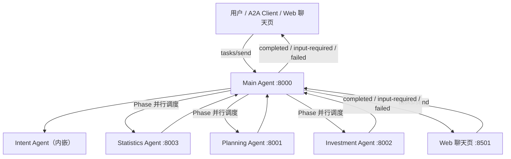

# powerproj-agent

基于 [Google A2A 协议](https://github.com/google/a2a) 的多 Agent 协作系统，面向电网投资、规划、统计等业务场景。核心编排采用 **LangChain + LangGraph**，各 Agent 以独立 A2A Server 运行，通过 JSON-RPC over HTTP 通信。

## 系统架构

用户请求统一进入 **主控 Agent (Main Agent)**，由它调用意图识别模块解析任务，再按依赖关系分阶段调度下游业务 Agent，最后汇总各任务结果返回。除 curl / A2A Client 外，也可通过 **Web 聊天页**（`:8501`）交互。



### 核心流程

1. **Agent 网络发现**：主控 Agent 启动时拉取下游 Agent Card，构建可用 Skill 能力列表
2. **意图识别**：将自然语言 query 解析为带依赖关系与 `required_capability` 的子任务规划
3. **澄清与计划确认**：任务为空、`clarification_prompt` 非空、或 `required_agent` 无效时澄清；否则进入计划确认（`plan_confirm`），用户确认后再执行
4. **分阶段并行**：按 DAG 拓扑分层，同层任务 `asyncio.gather` 并行，层间串行
5. **失败熔断**：单任务最多重试 3 次，任一任务最终失败则终止后续 Phase
6. **结果汇总**：LLM 生成自然语言总结，并保留各业务 Agent 原始 artifacts

## Agent 一览

| Agent | 目录 | 端口 | 说明 |
|-------|------|------|------|
| 主控 Agent | `main_agent/` | 8000 | 用户统一入口，Agent 网络发现、任务编排与结果聚合 |
| 规划 Agent | `planning_agent/` | 8001 | 电力项目匹配、信息查询、节点文件管理（SQLite） |
| 投资 Agent | `investment_agent/` | 8002 | 电力项目投资测算与造价分析 |
| 统计 Agent | `statistics_agent/` | 8003 | 电力项目规模统计与指标对比 |
| 意图识别 | `intent_agent/` | — | 内嵌于主控 Agent，非独立服务 |
| Web 聊天页 | `web/` | 8501 | Streamlit 界面，通过主控 Agent 调度业务能力 |
| A2A 验证器 | `a2a_validator/` | — | Streamlit 诊断工具，验证任意 A2A 端点 |

### 能力路由

任务调度采用 **能力驱动** 模式：意图识别为每个子任务指定 `required_capability`（对应 AgentCard 中某个 Skill 的 `id`），主控 Agent 在已发现的 AgentCard 中查找匹配 Skill 并路由到对应 endpoint。

- **Endpoint 注册**：`main_agent/registry.py` 中的 `DEFAULT_AGENT_URLS` 定义下游 Agent 地址
- **能力匹配与调用**：`main_agent/executor.py` 根据 `required_capability` 查找 Skill 并发起 A2A 请求

| Agent | Endpoint | Skill id |
|-------|----------|----------|
| planning-agent | `http://localhost:8001` | `project-query`, `file-management` |
| investment-agent | `http://localhost:8002` | `project-investment-analysis`, `project-cost-estimation` |
| statistics-agent | `http://localhost:8003` | `project-statistics`, `project-scale-comparison` |

## 技术栈

| 层级 | 技术 |
|------|------|
| A2A 协议 | `a2a-sdk` |
| LLM 框架 | `langchain`, `langchain-openai`, `langgraph` |
| Web 框架 | `starlette` + `uvicorn` |
| 配置管理 | `pydantic-settings` + `.env` |
| 数据库 | SQLite（Planning Agent） |
| HTTP 客户端 | `httpx` |
| 验证工具 / 聊天 UI | `streamlit` |
| 测试 | `pytest`, `pytest-asyncio` |

## 目录结构

```
powerproj-agent/
├── a2a_base.py              # A2A Server 快捷入口（get_a2a_app / create_server）
├── a2a_message_parser/      # A2A message.parts 解析，主控调用下游时传递上游上下文
├── a2a_validator/           # A2A 协议验证工具（Streamlit）
├── config/                  # 全局配置（pydantic-settings）
├── intent_agent/            # 意图识别 Agent（LangGraph，内嵌于主控）
├── main_agent/              # 主控 Agent（编排调度）
├── planning_agent/          # 规划 Agent（SQLite + 文件管理）
├── investment_agent/        # 投资 Agent
├── statistics_agent/        # 统计 Agent
├── providers/               # LLM 统一实例化
├── web/                     # Web 聊天页（Streamlit）
├── scripts/                 # 一键启动 / 停止脚本
├── examples/                # A2A 调用示例与演示脚本
├── spec/                    # 各 Agent 技术规格文档
├── AGENTS.md                # Agent 开发约束与编码规范
└── requirements.txt         # 项目依赖
```

## 快速开始

### 1. 环境准备

```bash
# 克隆项目
git clone <repo-url>
cd powerproj-agent

# 创建虚拟环境（推荐）
python -m venv .venv
source .venv/bin/activate   # Windows: .venv\Scripts\activate

# 安装依赖
pip install -r requirements.txt \
    -i https://pypi.tuna.tsinghua.edu.cn/simple --trusted-host pypi.tuna.tsinghua.edu.cn
```

### 2. 配置环境变量

在项目根目录创建 `.env` 文件：

```env
# 必需：OpenAI 兼容接口
OPENAI_API_KEY=your-api-key
OPENAI_API_BASE=https://your-api-base/v1   # 可选，默认使用 OpenAI 官方接口

# 可选：模型名称
CHAT_MODEL=gpt-4o-mini
EMBEDDING_MODEL=text-embedding-3-large

# 可选第三方服务
GEMINI_API_KEY=your-gemini-key
JINA_API_KEY=your-jina-key
MINERU_API_KEY=your-mineru-key
```

所有配置通过 `config/settings.py` 统一读取，各模块禁止直接访问 `os.environ`。

### 3. 启动服务

**必须先启动业务 Agent，再启动主控 Agent**：主控 Agent 在生命周期内会调用 `agent_network.discover()` 拉取下游 Agent Card，若业务 Agent 未就绪会导致发现失败。

#### 方式一：一键启动（推荐）

```bash
bash scripts/start_all.sh
```

脚本会依次启动三个业务 Agent、主控 Agent 和 Web 聊天页，日志写入 `logs/` 目录。停止所有服务：

```bash
bash scripts/stop_all.sh
```

| 服务 | 地址 |
|------|------|
| 规划 Agent | http://localhost:8001 |
| 投资 Agent | http://localhost:8002 |
| 统计 Agent | http://localhost:8003 |
| 主控 Agent | http://localhost:8000 |
| Web 聊天页 | http://localhost:8501 |

#### 方式二：分别启动

```bash
# 终端 1 - 规划 Agent
python planning_agent/main.py

# 终端 2 - 投资 Agent
python investment_agent/main.py

# 终端 3 - 统计 Agent
python statistics_agent/main.py

# 终端 4 - 主控 Agent（用户入口）
python main_agent/server.py

# 终端 5 - Web 聊天页（可选）
streamlit run web/app.py
```

启动后可访问各 Agent 的 Agent Card（a2a-sdk 默认路径）：

```bash
curl http://localhost:8000/.well-known/agent-card.json   # 主控
curl http://localhost:8001/.well-known/agent-card.json   # 规划
curl http://localhost:8002/.well-known/agent-card.json   # 投资
curl http://localhost:8003/.well-known/agent-card.json   # 统计
```

### 4. 发送请求

#### Web 聊天页

浏览器打开 http://localhost:8501 ，在界面中直接输入自然语言即可。页面会自动处理 `input-required` 多轮补全。

#### curl / A2A Client

通过 A2A JSON-RPC `tasks/send` 向主控 Agent 发送请求：

```bash
curl -X POST http://localhost:8000/ \
  -H "Content-Type: application/json" \
  -d '{
    "jsonrpc": "2.0",
    "method": "tasks/send",
    "params": {
      "id": "task-001",
      "sessionId": "session-001",
      "message": {
        "role": "user",
        "parts": [{"type": "text", "text": "帮我统计今年的投资收益，并做下明年的投资规划"}]
      }
    },
    "id": 1
  }'
```

响应状态说明：

| state | 含义 | 客户端行为 |
|-------|------|-----------|
| `completed` | 执行完成 | 读取 `artifacts` 获取结果 |
| `input-required` | 需要补充信息 | 用相同 `id` 再次 `tasks/send`，携带补充内容 |
| `failed` | 执行失败 | 读取错误信息 |

#### 中断恢复示例

当主控返回 `input-required` 时，客户端使用相同 `id` 再次发送即可恢复：

```bash
curl -X POST http://localhost:8000/ \
  -H "Content-Type: application/json" \
  -d '{
    "jsonrpc": "2.0",
    "method": "tasks/send",
    "params": {
      "id": "task-001",
      "sessionId": "session-001",
      "message": {
        "role": "user",
        "parts": [{"type": "text", "text": "2025 年"}]
      }
    },
    "id": 2
  }'
```

### 5. A2A 协议验证

使用 Streamlit 验证器对任意 A2A 端点进行健康检查：

```bash
streamlit run a2a_validator/app.py
```

验证器按以下顺序执行，前置失败则后续短路：

| 验证项 | 说明 |
|--------|------|
| 连通性探测 | 检查 `GET {base_url}` 是否可达 |
| Agent Card | 检查 `/.well-known/agent-card.json` 是否可解析 |
| 单消息测试 | 使用 `tasks/send` 发送测试消息 |
| 流式测试 | 根据 Agent Card 的 `streaming` 能力决定是否测试 SSE 流式响应 |

## 规划 Agent 能力

规划 Agent 是功能最完整的业务 Agent，核心能力包括：

- **项目智能匹配**：根据自然语言在 SQLite 项目库中匹配电力项目
- **多轮交互确认**：匹配结果需用户确认（`input-required` + `interrupt` 恢复）
- **项目信息查询**：支持明细查询与聚合统计（如变电容量总和、项目数量等）
- **节点文件管理**：按节点编码（001 可研设计 / 002 可研评审 / 003 可研批复）上传、下载、删除文件
- **文件下载路由**：`GET /files/{file_id}`，例如 `http://localhost:8001/files/1`

详细规格见 [`spec/planning_agent_spec.md`](spec/planning_agent_spec.md)。

## 示例代码

`examples/` 目录提供 A2A 协议交互参考：

| 目录 | 说明 | 运行方式 |
|------|------|----------|
| `examples/a2a/single-message/` | 单消息基础 Server / Client | 分别启动 `server.py` 与 `client.py` |
| `examples/a2a/streaming/` | SSE 流式推送完整链路 | 启动 `server.py` 后运行 `client.py` |
| `examples/a2a/visit_video_agent/` | 带进度反馈和文件 Artifact 的视频下载 Agent | 启动 `video_download_agent.py` 后运行 `video_download_client.py` |
| `examples/agents/task_planning_and_dispatch/` | 任务规划与分发参考 | 按目录内 README 说明运行 |

详见 [`examples/a2a/README.md`](examples/a2a/README.md)。

## 测试

测试按 `unit/` 与 `functional/` 组织：

```bash
# 单元测试
pytest planning_agent/tests/unit -v
pytest main_agent/tests/unit -v
pytest intent_agent/tests/unit -v
pytest a2a_message_parser/tests -v
pytest a2a_validator/tests -v

# 功能测试（Planning Agent 默认跳过，需显式开启）
RUN_FUNCTIONAL_TESTS=1 pytest planning_agent/tests/functional -v

# 意图识别功能测试（需配置 LLM 环境变量，未配置时自动跳过）
pytest intent_agent/tests/functional -v
```

功能测试直接访问真实目录和服务，不模拟数据。更多测试规范见 [`AGENTS.md`](AGENTS.md)。

## 规格文档

各 Agent 的详细技术规格见 `spec/` 目录：

| 文档 | 说明 |
|------|------|
| [`spec/main_agent_spec.md`](spec/main_agent_spec.md) | 主控 Agent：编排流程、LangGraph 状态图、A2A 接口 |
| [`spec/intent_agent_spec.md`](spec/intent_agent_spec.md) | 意图识别：任务规划模型、Prompt 规范 |
| [`spec/planning_agent_spec.md`](spec/planning_agent_spec.md) | 规划 Agent：数据模型、节点流程、文件管理 |
| [`spec/a2a_validator_spec.md`](spec/a2a_validator_spec.md) | A2A 验证器：验证项与输出结构 |

修改 Agent 核心逻辑时，需同步更新对应 spec 文档与测试。开发约束详见 [`AGENTS.md`](AGENTS.md)。

## 设计原则

- **LangGraph 节点极简**：每个节点只做一件事，状态通过 `state` 对象传递
- **能力驱动路由**：子任务通过 `required_capability` 匹配 AgentCard Skill，而非硬编码业务类型
- **中断恢复**：使用 `interrupt` + `Command(resume=...)` 实现多轮交互，不引入外部消息队列
- **Phase 分层并行**：DAG 拓扑分层，同层并行、层间串行
- **任务级熔断**：单任务重试 3 次仍失败，立即停止后续 Phase
- **LLM 集中管理**：统一由 `providers/llm_provider.py` 实例化，禁止各模块自行创建模型客户端
- **配置集中管理**：统一通过 `config/settings.py` 读取 `.env`，禁止模块内直接读环境变量

## 注意事项

- `.env` 含敏感信息，已加入 `.gitignore`，请勿提交到版本库
- 统计 Agent 与投资 Agent 当前返回固定测试数据，用于验证编排链路
- 意图识别 Agent 的 RAG 少样本检索（`intent_agent/rag_stub.py`）当前返回空列表，后续可接入 RAG 模块
