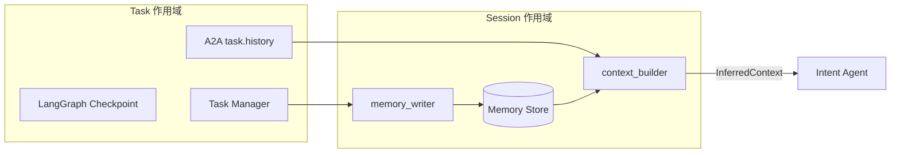
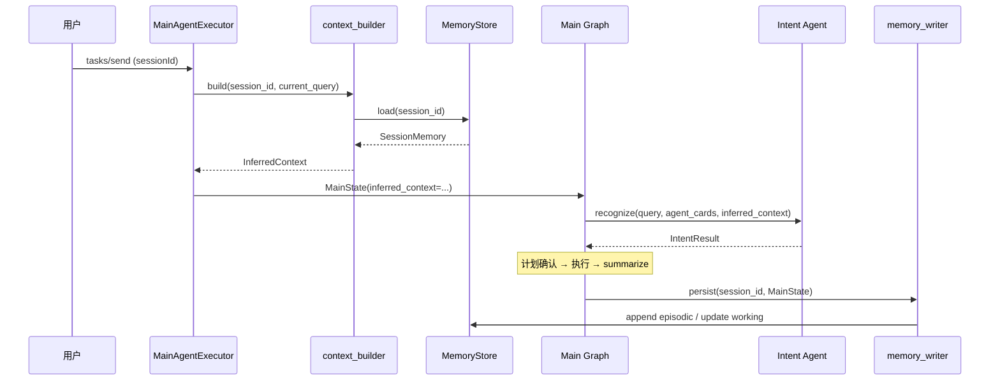

# Agent Memory 技术规格

## 1. 概述

本文档定义 **Agent Memory** 模块：在主控 Agent 会话维度持久化、推断并注入跨轮次上下文，使用户在省略指代、延续话题时（如「还是刚才那个项目」「把文件也下一下」），Intent Agent 仍能正确理解意图并产出可执行计划。

### 1.1 设计目标

1. **跨轮次上下文推断**：从 session 历史与历次执行结果中推断当前对话焦点（项目、时间范围、业务偏好等）
2. **Intent 增强**：在意图识别前注入结构化 `InferredContext`，提升指代消解与任务规划准确率
3. **执行后沉淀**：单次 task 完成后，将计划摘要与关键实体写入 session memory，供后续轮次读取
4. **与运行态分离**：Agent Memory 与 LangGraph checkpoint、Task Manager 单次计划状态职责清晰、存储 key 独立

### 1.2 明确不做

| 方案 | 说明 |
|------|------|
| 替代 LangGraph checkpoint | checkpoint 仍负责单次 task 的中断恢复（`thread_id = task_id`） |
| 替代 A2A task.history | 原始对话历史仍由 A2A SDK 维护；Memory 存**推断结果**与**结构化摘要**，不重复全量镜像 |
| 替代 RAG 知识库 | 领域文档检索见 `rag/`；Memory 管「用户/session 发生了什么」，不管规程条文 |
| 放入 Task Manager | Task Manager 仅产出单次 run 快照作为写入数据源，不拥有 store |
| 放入 executor.py | A2A 客户端无会话语义，不参与 memory 读写 |
| 各业务 Agent 各自维护 session memory | 会话级 memory 由主控统一读写；业务 Agent 仍只接收 message.parts 中的任务上下文 |

### 1.3 与现有文档关系

| 文档 | 关系 |
|------|------|
| [main_agent_spec.md](./main_agent_spec.md) | Main Agent 在 execute 入口读 memory、run 结束写 memory |
| [task_manager_spec.md](./task_manager_spec.md) | 计划完成后向 memory_writer 投递 episodic 快照 |
| [intent_agent_spec.md](./intent_agent_spec.md) | Intent Agent 输入扩展 `inferred_context` 字段 |
| `rag/`（待实现） | 领域知识检索；与 Agent Memory 在 `context_builder` 层合并注入，模块独立 |

---

## 2. 术语

| 术语 | 说明 |
|------|------|
| Agent Memory | 本文档定义的跨轮次会话记忆子系统，目录 `memory/` |
| Session | 用户连续对话边界，对应 A2A `sessionId`；存储主 key |
| Context | A2A `context_id`，可与 session 一对多；M1 与 sessionId 等同处理 |
| Task | 单次 A2A task（`task_id`），对应 LangGraph `thread_id` |
| InferredContext | 从 memory 组装后、供 LLM 使用的结构化推断上下文 |
| Working Memory | 当前 session 活跃焦点：active_project、active_time_range 等 |
| Episodic Memory | 最近 N 次计划/执行的摘要条目 |
| Semantic Memory | 较稳定的用户偏好（输出格式、默认电压等级等） |
| Raw Tail | 最近 K 轮用户/助手原文片段，供 inferencer 兜底 |
| Memory Store | 持久化后端抽象（M1：SQLite；后续可换 Redis/Postgres） |
| context_builder | 读 store → 组装 `InferredContext` |
| memory_writer | 从单次 run 提取条目 → 写 store |
| inferencer | 可选 LLM 模块，从 raw tail + episodic 更新 working/semantic |

---

## 3. 三种「上下文」边界

| 类型 | 负责模块 | 存储 Key | 生命周期 | 典型内容 |
|------|----------|----------|----------|----------|
| **运行态** | MainState / Task Manager / LangGraph checkpoint | `task_id` | 单次 task | 计划状态、子任务输出、interrupt 点 |
| **对话历史** | A2A Task Store | `task_id` | 单次 task | 原始 message.parts |
| **Agent Memory** | `memory/` | `session_id` | 跨 task、跨轮次 | 推断焦点、历史计划摘要、用户偏好 |



---

## 4. 架构总览

### 4.1 模块职责

```
memory/
├── models.py            # MemoryEntry、SessionMemory、InferredContext
├── store.py             # MemoryStore 抽象 + SQLite 实现
├── context_builder.py   # 读 memory，组装 InferredContext
├── memory_writer.py     # 从 MainState 提取并写入
├── inferencer.py        # （M3）LLM 推断 working / semantic
├── extractors.py        # （M2）规则化实体提取（项目名、文件等）
└── tests/unit/          # 单元测试
```

| 模块 | 读/写 | 调用方 |
|------|-------|--------|
| `context_builder` | 读 | `MainAgentExecutor` / graph `recognize_and_check` 前 |
| `memory_writer` | 写 | graph `summarize` 后或 `handle_cancelled` / `finalize` |
| `inferencer` | 读+写 | `context_builder` 内可选调用（M3） |
| `extractors` | — | `memory_writer` 内调用（M2） |

### 4.2 端到端流程



---

## 5. 数据模型

### 5.1 MemoryEntryType

```python
MEMORY_ENTRY_TYPE = Literal[
    "working",      # 当前 session 活跃焦点（单条或少量，可覆盖更新）
    "episodic",     # 单次 plan/run 摘要（追加，保留最近 N 条）
    "semantic",     # 用户偏好（合并更新）
    "raw_tail",     # 最近对话原文片段（追加，保留最近 K 条）
]
```

### 5.2 MemoryEntry

```python
class MemoryEntry(BaseModel):
    """Session memory 中的单条记录。"""

    id: str                          # UUID
    session_id: str
    entry_type: str                  # MemoryEntryType
    task_id: Optional[str] = None    # episodic 关联的 A2A task_id
    created_at: str                  # ISO8601
    updated_at: str
    content: Dict[str, Any]          # 类型相关 payload，见下文
    source: str = "system"           # system | user | inferencer | extractor
```

### 5.3 Working Memory Content

```python
class WorkingMemoryContent(BaseModel):
    """当前 session 活跃焦点。"""

    active_project: Optional[str] = None       # 如「北京西500千伏项目」
    active_project_code: Optional[str] = None
    active_time_range: Optional[str] = None    # 如「2025年」
    active_agents: List[str] = []              # 最近使用的业务 Agent
    last_task_goal: Optional[str] = None
    last_plan_revision: Optional[int] = None
    notes: List[str] = []                      # inferencer 附加短注
```

### 5.4 Episodic Memory Content

```python
class EpisodicTaskSummary(BaseModel):
    task_id: str
    name: str
    required_agent: str
    status: str                      # completed | failed | skipped

class EpisodicMemoryContent(BaseModel):
    """单次 plan/run 摘要。"""

    task_id: str
    plan_revision: int
    goal: str
    plan_status: str                 # completed | cancelled | failed
    tasks_summary: List[EpisodicTaskSummary]
    key_entities: Dict[str, Any] = {}   # 如 project, files, metrics
    summary_excerpt: Optional[str] = None # summarize 节点产出摘要前 500 字
```

示例 `key_entities`：

```json
{
  "project": {"name": "北京西500千伏项目", "code": "BJX500"},
  "files": [{"name": "可研设计.pdf", "url": "http://..."}],
  "metrics": {"investment_total": "12.3亿"}
}
```

### 5.5 Semantic Memory Content

```python
class SemanticMemoryContent(BaseModel):
    """用户偏好，合并更新。"""

    preferred_output_format: Optional[str] = None   # text | excel | report
    default_voltage_level: Optional[str] = None
    frequent_agents: Dict[str, int] = {}            # agent_name -> 使用次数
    custom: Dict[str, Any] = {}                       # 扩展键值
```

### 5.6 InferredContext（输出给 Intent Agent）

```python
class InferredContext(BaseModel):
    """context_builder 组装结果，注入 Intent 提示词。"""

    session_id: str
    working: Optional[WorkingMemoryContent] = None
    recent_episodes: List[EpisodicMemoryContent] = []   # 默认最近 3 条
    semantic: Optional[SemanticMemoryContent] = None
    context_prompt: str = ""                            # 格式化后的 prompt 段落
    inference_reasoning: Optional[str] = None           # inferencer 说明（调试用）
```

### 5.7 SessionMemory（Store 聚合视图）

```python
class SessionMemory(BaseModel):
    session_id: str
    working: Optional[MemoryEntry] = None
    semantic: Optional[MemoryEntry] = None
    episodic: List[MemoryEntry] = []       # 按 created_at 降序
    raw_tail: List[MemoryEntry] = []
    updated_at: str
```

---

## 6. Memory Store

### 6.1 接口

```python
class MemoryStore:
    """Session memory 持久化抽象。"""

    async def load_session(self, session_id: str) -> SessionMemory: ...

    async def upsert_working(
        self, session_id: str, content: WorkingMemoryContent, *, task_id: Optional[str] = None
    ) -> MemoryEntry: ...

    async def append_episodic(
        self, session_id: str, content: EpisodicMemoryContent
    ) -> MemoryEntry: ...

    async def upsert_semantic(
        self, session_id: str, content: SemanticMemoryContent
    ) -> MemoryEntry: ...

    async def append_raw_tail(
        self, session_id: str, role: str, text: str, *, task_id: Optional[str] = None
    ) -> MemoryEntry: ...

    async def trim_episodic(self, session_id: str, max_entries: int) -> None: ...

    async def trim_raw_tail(self, session_id: str, max_entries: int) -> None: ...
```

### 6.2 存储实现（M1）

- 后端：**SQLite** 单文件，路径由 `config/settings.py` 配置（如 `MEMORY_DB_PATH`）
- 表：`memory_entries(session_id, entry_type, task_id, content_json, created_at, updated_at)`
- `working` / `semantic`：同 session 同 type 仅保留最新一条（upsert）
- `episodic` / `raw_tail`：追加后 trim

### 6.3 容量默认策略

| 类型 | 默认上限 | 超出行为 |
|------|----------|----------|
| episodic | 10 条/session | 删除最旧 |
| raw_tail | 20 条/session | 删除最旧 |
| working | 1 条 | 覆盖 |
| semantic | 1 条 | 合并覆盖 |

阈值通过 `config/settings.py` 可调。

---

## 7. context_builder

### 7.1 接口

```python
class ContextBuilder:
    def __init__(self, store: MemoryStore, inferencer: Optional[MemoryInferencer] = None): ...

    async def build(
        self,
        session_id: str,
        *,
        current_query: str,
        task_id: Optional[str] = None,
        enable_inference: bool = True,
    ) -> InferredContext:
        """
        1. load_session
        2. （M3）若 enable_inference 且 inferencer 可用，刷新 working/semantic
        3. 选取 recent_episodes（默认 3）
        4. 格式化为 context_prompt 文本
        """
```

### 7.2 context_prompt 格式（注入 Intent）

```text
## 会话上下文（由 Agent Memory 推断，供指代消解与任务规划参考）

### 当前焦点
- 活跃项目：北京西500千伏项目（编码 BJX500）
- 上次任务目标：查询项目信息并下载可研设计文件

### 最近执行摘要
1. [2025-06-18] 已完成：查询北京西500千伏项目信息；下载可研设计.pdf
2. [2025-06-17] 已完成：统计2025年投资完成率

### 用户偏好
- 常使用 Agent：planning-agent

若用户 query 中存在「这个」「刚才」「继续」等指代，请结合上述上下文解析；若与当前 query 冲突，以当前 query 为准。
```

### 7.3 调用时机

| 时机 | 位置 | 说明 |
|------|------|------|
| **读** | `MainAgentExecutor.execute`，新建 run 且非 interrupt resume 时 | resume 澄清/plan_confirm 时可跳过全量 rebuild，仅追加 raw_tail |
| **读** | graph `recognize_and_check` 节点入口 | 若 state 尚无 `inferred_context` 则调用 |

`InferredContext` 写入 `MainState`：

```python
class MainState(BaseModel):
    # ... 现有字段 ...
    inferred_context: Optional[InferredContext] = None
```

---

## 8. memory_writer

### 8.1 接口

```python
class MemoryWriter:
    def __init__(self, store: MemoryStore, extractors: EntityExtractors): ...

    async def persist_run(
        self,
        session_id: str,
        state: MainState,
        *,
        assistant_summary: Optional[str] = None,
    ) -> None:
        """
        单次 task 结束时调用（completed / cancelled / failed 均可，按 plan_status 写入）。

        1. append_episodic（来自 task_plan + task_outputs + summary_excerpt）
        2. extractors 更新 working（项目、文件、时间范围等）
        3. 更新 semantic.frequent_agents 计数
        4. append_raw_tail（本轮 user query 片段 + assistant_summary 摘要）
        5. trim episodic / raw_tail
        """
```

### 8.2 数据来源（与 Task Manager 关系）

| 字段 | 来源 |
|------|------|
| `goal` / `plan_status` / `tasks_summary` | `state.task_plan`（见 [task_manager_spec.md](./task_manager_spec.md)） |
| `key_entities.project` | `extractors.from_task_outputs` 或 planning-agent 返回文本 |
| `key_entities.files` | `task_outputs` 中 file artifact |
| `summary_excerpt` | `state.summary` |
| `working.active_project` | 规则提取优先；M3 inferencer 补充 |

Task Manager **不调用** memory_writer；graph 在 `summarize` / `handle_cancelled` / `finalize` 节点末尾调用。

### 8.3 写入时机

| 节点 | 条件 |
|------|------|
| `summarize` 之后 | `plan_status in (completed, failed)` |
| `handle_cancelled` | `plan_status == cancelled` |
| `direct_reply` 之后 | 可选：仅 append raw_tail，不写 episodic |

---

## 9. extractors 与 inferencer

### 9.1 EntityExtractors（M2，规则优先）

```python
class EntityExtractors:
    def from_task_outputs(
        self, task_outputs: Dict[str, TaskOutput]
    ) -> Dict[str, Any]:
        """从业务 Agent artifacts 提取 project、files、metrics 等。"""

    def from_intent_result(self, intent_result: IntentResult) -> Dict[str, Any]:
        """从 task_goal / subtask description 提取候选实体。"""
```

规则示例：

- 项目名：匹配 planning-agent 返回中的「项目名称：XXX」
- 文件：收集 `type=file` artifact 的 name/url
- 时间范围：从 query / goal 中匹配「YYYY年」「本季度」等

规则提取**可单测、可复现**；作为 working memory 的主要写入来源。

### 9.2 MemoryInferencer（M3，LLM 可选）

```python
class MemoryInferencer:
    def __init__(self, llm: BaseChatModel): ...

    async def infer(
        self,
        session_memory: SessionMemory,
        current_query: str,
    ) -> tuple[WorkingMemoryContent, SemanticMemoryContent, str]:
        """
        输入：working + 最近 episodic + raw_tail + current_query
        输出：更新后的 working、semantic、reasoning
        structured output，失败时返回原 working/semantic 不阻断主流程
        """
```

使用场景：

- 「那个项目」「继续」类指代，规则无法覆盖时
- 从多轮 raw_tail 归纳 `active_time_range`、`notes`

**约束**：inferencer 失败不得阻断主流程；降级为仅使用规则提取结果。

---

## 10. Intent Agent 集成

### 10.1 输入扩展

在 [intent_agent_spec.md](./intent_agent_spec.md) 输入中增加可选字段：

```json
{
  "query": "把那个项目的可研文件也下一下",
  "agent_cards": [],
  "inferred_context": {
    "context_prompt": "## 会话上下文\n...",
    "working": {
      "active_project": "北京西500千伏项目",
      "active_project_code": "BJX500"
    }
  }
}
```

### 10.2 Prompt 注入位置

在 `intent_agent/prompts.py` 的 system prompt 中，于「可用业务 Agent 列表」之后、「任务分解原则」之前插入：

```
{inferred_context_block}
```

当 `inferred_context` 为空或 `context_prompt` 为空字符串时，该块省略。

### 10.3 输出行为约定

- Intent Agent **不写入** memory
- 若指代仍无法消解，`subtasks` 为空并给出 `clarification_prompt`（与现有逻辑一致）
- Memory 提供的实体仅作参考；**与用户当前 query 冲突时以 query 为准**（在 prompt 中明确）

---

## 11. Main Agent 集成

### 11.1 MainAgentExecutor 改造

```python
# execute() 伪代码
session_id = task.session_id if task and task.session_id else context_id

if not state.next:  # 新 run，非 resume
    inferred = await context_builder.build(
        session_id,
        current_query=current_text,
        task_id=task_id,
    )
    initial_state = MainState(
        query=full_query,
        session_id=session_id,
        inferred_context=inferred,
    )
else:
    # resume：沿用 checkpoint 中 inferred_context，可选 append raw_tail
    ...
```

### 11.2 session_id 与 context_id

| 字段 | 用途 |
|------|------|
| `sessionId`（A2A） | Memory Store **主 key** |
| `context_id` | 若 `sessionId` 缺失，回退为 `context_id` |
| `task_id` | episodic 条目关联；checkpoint thread_id |

### 11.3 Graph 节点钩子

| 节点 | Memory 操作 |
|------|-------------|
| `recognize_and_check` | 使用 `state.inferred_context` 调用 Intent |
| `summarize` | 完成后 `memory_writer.persist_run` |
| `handle_cancelled` | 取消后 `memory_writer.persist_run` |
| `direct_reply` | 可选 `append_raw_tail` only |

---

## 12. 与 RAG 的协作（后续）

| | Agent Memory | RAG |
|---|--------------|-----|
| 数据源 | 会话、执行结果 | 文档库、向量索引 |
| 回答问题 | 用户刚才在做什么 | 领域知识是什么 |
| 注入点 | Intent 前 `context_prompt` | Intent 或业务 Agent 的 domain 块 |

合并策略（未来 `context_builder.build` 扩展）：

```python
domain_context = await rag_retriever.retrieve(current_query)  # 可选
# context_prompt = memory_block + domain_block
```

M1～M3 **不依赖** RAG 实现。

---

## 13. 配置项

在 `config/settings.py` 中新增：

```python
MEMORY_DB_PATH: str = "data/agent_memory.db"
MEMORY_EPISODIC_MAX_ENTRIES: int = 10
MEMORY_RAW_TAIL_MAX_ENTRIES: int = 20
MEMORY_RECENT_EPISODES_FOR_INTENT: int = 3
MEMORY_ENABLE_INFERENCER: bool = False   # M3 默认关闭
```

---

## 14. 分阶段实施

| 阶段 | 范围 | 交付物 |
|------|------|--------|
| **M1** | 存储骨架 | `memory/models.py`、`store.py`（SQLite）；`append_episodic` / `load_session`；Executor 传入 session_id |
| **M2** | 读写闭环 | `context_builder`、`memory_writer`、`extractors`；Intent 注入 `context_prompt`；graph 结束 persist |
| **M3** | LLM 推断 | `inferencer.py`；`MEMORY_ENABLE_INFERENCER`；指代消解增强 |
| **M4** | 增强 | 持久化后端可插拔；与 RAG 合并；跨 session 长期记忆（用户级 key，可选） |

每阶段完成后更新 [intent_agent_spec.md](./intent_agent_spec.md)、[main_agent_spec.md](./main_agent_spec.md) 对应章节。

---

## 15. 测试规范

### 15.1 单元测试（`memory/tests/unit/`）

| 文件 | 覆盖 |
|------|------|
| `test_store.py` | upsert/append/trim/load；临时 SQLite 文件 |
| `test_context_builder.py` | 空 session、有 episodic 时 `context_prompt` 格式 |
| `test_memory_writer.py` | 从 mock MainState + task_plan 写入 episodic/working |
| `test_extractors.py` | 项目名、文件 URL 规则提取 |

### 15.2 集成测试要点（main_agent）

1. 同一 `sessionId` 两次 task：第二次 Intent 输入含第一次的 `active_project`
2. memory_writer 失败不导致主流程 failed
3. inferencer 关闭时，规则提取路径仍可用
4. resume interrupt 时不重复全量 inferencer 调用（性能）

所有单元测试数据模拟，不访问真实 LLM 与 A2A endpoint。

---

## 16. 附录：场景示例

### 16.1 指代消解

**Turn 1**（task-1，session-A）

- 用户：「查北京西500千伏项目信息并下载可研文件」
- 执行完成 → memory 写入 `active_project=北京西500千伏项目`，episodic 记录 goal 与文件

**Turn 2**（task-2，session-A）

- 用户：「把这个项目的评审意见也下一下」
- `context_builder` 注入 active_project
- Intent 产出 subtasks：依赖 planning-agent 文件 下载，description 含「北京西500千伏项目」

### 16.2 与计划确认模式协作

Turn 2 仍走 [task_manager_spec.md](./task_manager_spec.md) 的 `plan_confirm`：Memory 影响的是 **Intent 拆计划**，不改变「确认后再执行」闸门。

### 16.3 Memory 不解决的问题

- 用户首次发言且无历史：InferredContext 为空，Intent 仅依赖 query
- 业务规程问答：应走 RAG，不应伪造到 episodic
- 单次 task 内子任务依赖：仍由 `task_outputs` + `build_task_parts` 传递，不读 session memory
