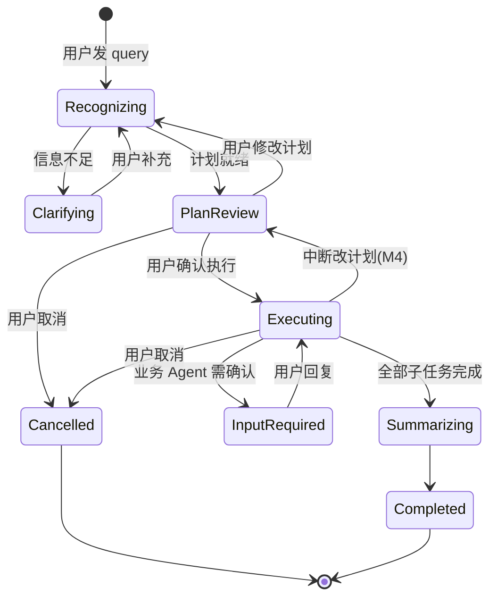

# 任务管理器 (Task Manager) 与计划确认模式 技术规格

## 1. 概述

本文档定义主控 Agent 的**计划确认执行模式**：在意图识别产出子任务计划后，先向用户展示计划并等待确认，确认后才调度业务 Agent 执行；执行过程中支持取消，并对外呈现类似 Cursor Plan 的子任务进度。

### 1.1 设计目标

1. **计划确认后再执行**：子任务计划就绪后，通过 `plan_confirm` interrupt 等待用户确认，未确认前不得调用业务 Agent
2. **进度可见**：以结构化任务清单 + 状态（pending / in_progress / completed / failed / skipped）呈现给用户
3. **执行中可中断**：支持整单取消；后续阶段支持中断后修改剩余计划
4. **可预期、可测试**：执行阶段仍采用确定性 DAG 调度，不由 Orchestrator LLM 动态决定调用顺序

### 1.2 明确不做

| 方案 | 说明 |
|------|------|
| 业务 Agent 封装为 LangChain Tool | 不引入 Orchestrator LLM tool-calling 执行循环 |
| Skill 级 Tool 暴露 | 业务 Agent 调用仍走现有 A2A `call_business_agent` |
| 执行中 LLM 动态改道 | 改计划仅在用户显式触发时，通过重新 Intent 实现 |

### 1.3 与现有文档关系

| 文档 | 关系 |
|------|------|
| [main_agent_spec.md](./main_agent_spec.md) | 主控 Agent 整体规格；本模式对其 graph、状态、A2A 协议做扩展 |
| [intent_agent_spec.md](./intent_agent_spec.md) | Intent Agent 输出格式不变；其 `IntentResult` 作为 Task Manager 的计划输入 |
| [agent_memory_spec.md](./agent_memory_spec.md) | 计划完成后向 memory_writer 投递 episodic 快照；Intent 前注入会话上下文 |

---

## 2. 术语

| 术语 | 说明 |
|------|------|
| Task Manager | 新建模块，负责托管计划清单、子任务状态、计划版本、进度事件与取消标志 |
| ManagedTaskPlan | Task Manager 托管的完整计划，含 goal、tasks、plan_status、revision |
| ManagedTask | 计划中的单个子任务，在 Intent `SubTask` 基础上增加运行时 `status` |
| 计划确认 (plan_confirm) | 执行前 interrupt 类型，展示计划并等待用户确认 / 修改 / 取消 |
| 澄清 (clarification) | 计划前 interrupt 类型，信息不足时等待用户补充 query |
| 业务确认 (business_confirm) | 执行中 interrupt 类型，业务 Agent 返回 `input_required` 时触发（已有） |
| 计划闸门 | graph 节点 `await_plan_approval`，未获确认不得进入 `build_phases` |
| 协作式取消 | 在 Phase 边界检查 `cancel_requested`，当前 Phase 内任务自然结束或超时后停止后续 Phase |

---

## 3. 架构总览

### 3.1 模块职责

```
┌─────────────────────────────────────────────────────────────────┐
│                        Main Agent Graph                          │
│  recognize_and_check → prepare_plan → await_plan_approval        │
│       → build_phases → execute_current_phase → summarize         │
└───────────────┬───────────────────────────────┬─────────────────┘
                │                               │
        ┌───────▼───────┐               ┌───────▼───────┐
        │  Intent Agent │               │ Task Manager  │
        │  （规划 LLM）  │               │ （计划+进度）  │
        └───────────────┘               └───────┬───────┘
                                                │ 状态读写
                                        ┌───────▼───────┐
                                        │ executor.py   │
                                        │ call_business │
                                        │ _agent (A2A)  │
                                        └───────────────┘
```

| 模块 | 职责 | 变更 |
|------|------|------|
| Intent Agent | 解析 query，产出 `IntentResult` | 保留 |
| **Task Manager** | 计划清单、子任务状态、revision、进度事件、cancel 标志 | **新建** |
| Main Graph | 节点编排；插入计划确认与进度更新钩子 | 改造 |
| executor.py | `call_business_agent`：A2A HTTP、重试、`input_required` | **保留不动** |
| AgentNetwork | AgentCard 发现与注册 | 保留 |

> **关键原则**：Task Manager 管「计划与进度」，**不管** A2A 调用实现。业务 Agent 调用能力始终在 `main_agent/executor.py`。

### 3.2 端到端流程



### 3.3 与当前实现的差异

| 维度 | 当前实现 | 本规格 |
|------|----------|--------|
| 计划展示 | 无，识别后直接执行 | `plan_confirm` interrupt 展示计划 |
| 进度呈现 | `invocation_traces` 调用轨迹 | 新增 `__TASK_PROGRESS__` 结构化进度 |
| 取消 | `CancelTask` 仅发消息，不联动 graph | 协作式取消 + 部分结果返回 |
| 计划状态 | 仅 `intent_result` + `task_outputs` | `ManagedTaskPlan` 完整状态机 |

---

## 4. 数据模型

### 4.1 ManagedTaskStatus

```python
# 子任务运行时状态
MANAGED_TASK_STATUS = Literal[
    "pending",       # 待执行
    "in_progress",   # 执行中
    "completed",     # 已完成
    "failed",        # 执行失败
    "skipped",       # 取消后跳过
]
```

### 4.2 ManagedPlanStatus

```python
# 整体计划状态
MANAGED_PLAN_STATUS = Literal[
    "draft",         # 待用户确认
    "approved",      # 用户已确认，尚未开始执行
    "executing",     # 执行中
    "completed",     # 全部完成
    "cancelled",     # 用户取消
    "failed",        # 执行失败（熔断）
]
```

### 4.3 ManagedTask

```python
class ManagedTask(BaseModel):
    """托管子任务，由 Intent SubTask 初始化并附加运行时状态。"""

    id: str
    name: str
    description: str
    dependencies: List[str] = []
    expected_output: str
    required_agent: str
    confidence: float = 1.0
    status: str = "pending"          # ManagedTaskStatus
    started_at: Optional[str] = None
    completed_at: Optional[str] = None
    error: Optional[str] = None
```

### 4.4 ManagedTaskPlan

```python
class ProgressEvent(BaseModel):
    """进度时间线事件，供 UI 渲染。"""

    timestamp: str
    event_type: str                  # plan_created | plan_approved | task_started | task_completed | task_failed | plan_cancelled | plan_revised
    task_id: Optional[str] = None
    message: str = ""
    revision: int = 1


class ManagedTaskPlan(BaseModel):
    """Task Manager 托管的完整计划。"""

    revision: int = 1                  # 计划版本，改计划时 +1
    goal: str
    tasks: List[ManagedTask]
    plan_status: str = "draft"         # ManagedPlanStatus
    approved_at: Optional[str] = None
    cancel_reason: Optional[str] = None
    events: List[ProgressEvent] = []
```

### 4.5 MainState 扩展字段

在现有 `MainState`（见 [main_agent_spec.md](./main_agent_spec.md) §4.1）基础上新增：

```python
class MainState(BaseModel):
    # ... 现有字段保留 ...

    task_plan: Optional[ManagedTaskPlan] = None
    cancel_requested: bool = False
```

- `intent_result`：保留，作为 Intent Agent 原始输出
- `task_plan`：Task Manager 托管的运行时计划（含 status）
- `phases` / `task_outputs` / `current_phase_idx`：保留，执行阶段仍由 graph 使用
- `cancel_requested`：协作式取消标志，由 `CancelTask` 或用户消息设置

---

## 5. Task Manager 模块

### 5.1 文件位置

```
main_agent/
├── task_manager.py      # TaskManager 类与状态流转
├── task_models.py       # ManagedTask / ManagedTaskPlan / ProgressEvent
└── ...
```

### 5.2 接口定义

```python
class TaskManager:
    """任务计划与进度管理器。"""

    @staticmethod
    def create_plan_from_intent(intent_result: IntentResult) -> ManagedTaskPlan:
        """将 IntentResult 转为 draft 态 ManagedTaskPlan，所有子任务 status=pending。"""

    @staticmethod
    def approve_plan(plan: ManagedTaskPlan) -> ManagedTaskPlan:
        """用户确认执行：plan_status draft → approved，记录 approved_at 与事件。"""

    @staticmethod
    def cancel_plan(plan: ManagedTaskPlan, reason: str = "") -> ManagedTaskPlan:
        """取消计划：plan_status → cancelled；pending 任务 → skipped。"""

    @staticmethod
    def start_execution(plan: ManagedTaskPlan) -> ManagedTaskPlan:
        """进入执行：plan_status approved → executing。"""

    @staticmethod
    def mark_task_in_progress(plan: ManagedTaskPlan, task_id: str) -> ManagedTaskPlan:
        """子任务开始执行。"""

    @staticmethod
    def mark_task_completed(plan: ManagedTaskPlan, task_id: str) -> ManagedTaskPlan:
        """子任务执行成功。"""

    @staticmethod
    def mark_task_failed(
        plan: ManagedTaskPlan, task_id: str, error: str
    ) -> ManagedTaskPlan:
        """子任务执行失败。"""

    @staticmethod
    def mark_remaining_skipped(plan: ManagedTaskPlan) -> ManagedTaskPlan:
        """取消时将所有 pending / in_progress 任务标为 skipped。"""

    @staticmethod
    def revise_plan(
        plan: ManagedTaskPlan,
        new_intent_result: IntentResult,
        *,
        preserve_completed: bool = True,
    ) -> ManagedTaskPlan:
        """
        改计划：revision +1，合并新 IntentResult。
        preserve_completed=True 时保留已完成任务的 status 与 task_outputs 引用。
        """

    @staticmethod
    def build_progress_payload(plan: ManagedTaskPlan) -> Dict[str, Any]:
        """构建 __TASK_PROGRESS__ 流式推送 JSON。"""

    @staticmethod
    def build_plan_confirm_body(plan: ManagedTaskPlan) -> Dict[str, Any]:
        """构建 plan_confirm interrupt 的 body 字段。"""
```

### 5.3 不变量

1. `plan_status != "approved"` 且 `!= "executing"` 时，graph **不得**进入 `build_phases`
2. 子任务 `status == "completed"` 后不得回退为 `pending`（改计划时保留或显式 revision）
3. `revision` 仅在用户修改计划或中断改计划时递增
4. Task Manager **不发起** HTTP / A2A 调用

---

## 6. Main Graph 改造

### 6.1 节点变更

在现有 graph（见 [main_agent_spec.md](./main_agent_spec.md) §4.6）基础上调整：

| 节点 | 变更 |
|------|------|
| `recognize_and_check` | 保留；澄清 interrupt 逻辑不变 |
| **`prepare_plan`** | **新增**：`IntentResult` → `TaskManager.create_plan_from_intent` → 写入 `state.task_plan` |
| **`await_plan_approval`** | **新增**：`interrupt(plan_confirm)`；解析 resume 值路由 |
| `build_phases` | 保留；**仅**在 `task_plan.plan_status == "approved"` 后进入 |
| `execute_current_phase` | 改造：每步调用 TaskManager 更新进度；Phase 边界检查 `cancel_requested` |
| `summarize` | 保留；输入可增加 `task_plan` 摘要 |
| **`handle_cancelled`** | **新增**：组装取消结果 artifact |

### 6.2 边与路由

```
START
  → recognize_and_check
      ├─ (非业务 query) → direct_reply → END
      └─ (业务 query)
          → prepare_plan
          → await_plan_approval
              ├─ approve  → build_phases → execute_current_phase ⇄ ...
              ├─ modify   → recognize_and_check（query 追加用户修改说明）
              ├─ cancel   → handle_cancelled → END
              └─ (executing 中 cancel) → handle_cancelled → END
```

`await_plan_approval` resume 解析规则：

| 用户回复 / 按钮 | 识别条件 | 路由 |
|----------------|----------|------|
| 确认执行 | `replyText == "确认执行"` 或 option id `approve` | `approve_plan` → `build_phases` |
| 修改计划 | 以「修改计划」开头或 option id `modify` | 追加至 `query` → `recognize_and_check` |
| 取消 | `replyText == "取消"` 或 option id `cancel` | `handle_cancelled` |

### 6.3 澄清 vs 计划确认

| 场景 | interrupt 类型 | 触发条件 |
|------|----------------|----------|
| 澄清 | `clarification`（现有） | 无 subtasks、置信度 < 0.8、required_agent 无效 |
| 计划确认 | `plan_confirm`（新增） | subtasks 非空、校验通过、尚未 approved |

**规则**：澄清发生在计划之前；计划确认发生在执行之前。二者互斥——只有计划就绪后才展示 `plan_confirm`。

### 6.4 默认产品策略

1. **即使仅 1 个子任务且置信度为 1.0，仍走 plan_confirm**（体验统一）
2. **M1 修改计划**：用户以文本描述修改意图 → 重新 Intent → revision +1 → 再次 plan_confirm
3. **M1 取消**：整单取消，不做「跳过单个子任务继续跑」（M4 再评估）

---

## 7. Interrupt 与 A2A 协议

### 7.1 plan_confirm interrupt payload

graph 节点 `await_plan_approval` 调用 `interrupt` 时传入：

```json
{
  "type": "plan_confirm",
  "question": "我已为您制定以下执行计划，请确认是否开始执行：",
  "plan": {
    "revision": 1,
    "goal": "查询北京西500千伏项目信息并下载可研设计文件",
    "plan_status": "draft",
    "tasks": [
      {
        "id": "task_1",
        "name": "查询项目基本信息",
        "description": "根据项目名称查询北京西500千伏项目的基本信息",
        "required_agent": "planning-agent",
        "dependencies": [],
        "status": "pending"
      },
      {
        "id": "task_2",
        "name": "下载可研设计文件",
        "description": "定位并下载可研设计节点文件",
        "required_agent": "planning-agent",
        "dependencies": ["task_1"],
        "status": "pending"
      }
    ]
  }
}
```

### 7.2 A2A input-required 输出（计划确认）

`MainAgentExecutor` 检测到 `plan_confirm` interrupt 时，构造 `input-required` 消息：

```json
{
  "id": "task-uuid",
  "status": {
    "state": "input-required",
    "message": {
      "role": "agent",
      "parts": [
        {
          "text": "我已为您制定以下执行计划，请确认是否开始执行：\n\n1. [planning-agent] 查询项目基本信息\n2. [planning-agent] 下载可研设计文件"
        },
        {
          "mediaType": "application/vnd.powerproj.plan+json",
          "data": {
            "type": "plan_confirm",
            "action": "plan_confirm",
            "title": "执行计划确认",
            "body": {
              "revision": 1,
              "goal": "查询北京西500千伏项目信息并下载可研设计文件",
              "tasks": []
            },
            "options": [
              {"id": "approve", "label": "开始执行", "replyText": "确认执行"},
              {"id": "modify", "label": "修改计划", "replyText": "修改计划："},
              {"id": "cancel", "label": "取消", "replyText": "取消"}
            ]
          }
        }
      ]
    }
  }
}
```

> 约定：新增 MIME 类型 `application/vnd.powerproj.plan+json`，与现有 `application/vnd.powerproj.confirmation+json`（业务确认）并列。Web 客户端按 `data.type == "plan_confirm"` 渲染计划清单与操作按钮。

### 7.3 业务确认（已有，不变）

执行中业务 Agent 返回 `input_required` 时，仍走 `business_confirm` interrupt 与 confirmation 按钮机制，见 [main_agent_spec.md](./main_agent_spec.md) §3.3。

---

## 8. 流式进度协议

### 8.1 新增前缀

在现有流式前缀（`__INVOCATION_TRACE_STEP__`、`__SUMMARY_CHUNK__`）基础上新增：

| 前缀 | 含义 |
|------|------|
| `__TASK_PROGRESS__\n` + JSON | 任务计划进度快照 |

推送时机：

- 计划创建（draft）
- 用户确认（approved → executing）
- 每个子任务 `in_progress` / `completed` / `failed`
- 取消（cancelled）

### 8.2 progress payload 示例

```json
{
  "revision": 1,
  "plan_status": "executing",
  "goal": "查询北京西500千伏项目信息并下载可研设计文件",
  "tasks": [
    {"id": "task_1", "name": "查询项目基本信息", "status": "completed", "required_agent": "planning-agent"},
    {"id": "task_2", "name": "下载可研设计文件", "status": "in_progress", "required_agent": "planning-agent"}
  ],
  "completed_count": 1,
  "total_count": 2,
  "current_task_id": "task_2"
}
```

### 8.3 与 invocation_traces 的关系

| 通道 | 用途 |
|------|------|
| `__TASK_PROGRESS__` | 用户-facing 计划清单与勾选态（Plan UI） |
| `__INVOCATION_TRACE_STEP__` | 开发/调试-facing 调用细节（Agent 入参出参） |

二者并行推送，互不替代。

---

## 9. 取消与中断改计划

### 9.1 协作式取消（M3）

**触发方式**：

1. 客户端调用 A2A `CancelTask`
2. 用户在执行中发送「取消执行」类消息（resume 解析为 cancel）

**行为**：

1. `MainAgentExecutor.cancel` 除发送 cancelled 消息外，向 graph checkpoint 写入 `cancel_requested = true`
2. `execute_current_phase` 在 **每个 Phase 开始前** 检查该标志
3. 若已请求取消：
   - 调用 `TaskManager.mark_remaining_skipped`
   - `plan_status → cancelled`
   - **不**强行中断正在进行的单个 A2A HTTP 调用（等待其自然返回或超时）
   - 组装响应：已完成子任务的 `task_result` artifacts + 取消说明文本
4. 最终状态：`cancelled`（非 `failed`）

### 9.2 取消响应 artifact 示例

```json
{
  "type": "text",
  "text": "任务已取消。已完成 1/2 个子任务：\n- task_1 查询项目基本信息：成功\n- task_2 下载可研设计文件：已跳过"
}
```

### 9.3 中断改计划（M4，后续）

用户在执行中发送「停一下，第三个任务不要了，换成统计投资」：

1. 设置 `cancel_requested` 或专用 `replan_requested` 标志，在当前 Phase 边界暂停
2. 保留 `status == completed` 的子任务及 `task_outputs`
3. 将已完成结果摘要追加至 `query`，重新 Intent **仅针对剩余目标**
4. `TaskManager.revise_plan(revision + 1)` → 再次 `plan_confirm`（可仅展示剩余任务）
5. 用户确认后继续执行

---

## 10. 前端约定

### 10.1 计划确认 UI

- 解析 `application/vnd.powerproj.plan+json`
- 展示：`goal`、子任务列表（序号、名称、目标 Agent、依赖关系）
- 按钮：开始执行 / 修改计划 / 取消
- 「修改计划」可弹出文本输入框，提交后以 `修改计划：{用户输入}` 作为 resume 文本

### 10.2 执行进度 UI

- 监听 `__TASK_PROGRESS__` 前缀
- 渲染：pending（灰）、in_progress（高亮）、completed（勾选）、failed（红色）、skipped（删除线）
- `plan_status == cancelled` 时冻结进度条并展示取消说明

### 10.3 执行中停止

- 展示「停止」按钮，调用 A2A `CancelTask`
- 收到 `cancelled` 状态后停止轮询/流式接收

---

## 11. 分阶段实施

| 阶段 | 范围 | 交付物 |
|------|------|--------|
| **M1** | 计划闸门 | `task_models.py`、`task_manager.py`；graph 节点 `prepare_plan`、`await_plan_approval`、`handle_cancelled`；`plan_confirm` A2A 输出；确认后才 `build_phases` |
| **M2** | 进度展示 | `__TASK_PROGRESS__` 流式推送；`MainAgentExecutor` / `streaming.py` 扩展；前端 Plan UI |
| **M3** | 执行中取消 | `cancel_requested` 与 graph 联动；`CancelTask` 增强；部分结果返回 |
| **M4** | 中断改计划 | `revise_plan`；执行中 replan 路由；保留已完成任务 |

每阶段完成后须同步更新 [main_agent_spec.md](./main_agent_spec.md) 对应章节，并补充单元测试。

---

## 12. 测试规范

### 12.1 单元测试（`main_agent/tests/unit/`）

| 测试文件 | 覆盖 |
|----------|------|
| `test_task_manager.py` | `create_plan_from_intent`、状态流转、`revise_plan`、`build_progress_payload` |
| `test_main_agent.py`（扩展） | `plan_confirm` interrupt、`approve` / `modify` / `cancel` 路由、未确认不执行 |

### 12.2 测试要点

1. **未确认不执行**：`plan_status == draft` 时 `call_business_agent` 不得被调用
2. **确认后执行**：resume「确认执行」后进入 `build_phases`，业务 Agent 被调用
3. **修改计划**：resume「修改计划：...」后 revision 递增，重新 Intent
4. **取消**：resume「取消」后 `plan_status == cancelled`，无业务 Agent 调用
5. **进度事件**：每个子任务状态变更后 `build_progress_payload` 计数正确
6. **M3 取消**：Phase 边界 `cancel_requested` 生效，pending 任务变 skipped

所有单元测试数据模拟，不访问真实 A2A endpoint；`call_business_agent` 使用 mock。

---

## 13. 附录：完整请求示例

### 13.1 计划确认 → 用户确认 → 执行完成

**第一次 tasks/send**（用户 query）→ 返回 `input-required`（plan_confirm）

**第二次 tasks/send**（相同 task id，用户回复「确认执行」）→ 流式推送 `__TASK_PROGRESS__` + `__INVOCATION_TRACE_STEP__` → 最终 `completed`

### 13.2 计划确认 → 用户修改

**第二次 tasks/send**（「修改计划：只要项目信息，不要下载文件」）→ 再次 `input-required`（plan_confirm，revision=2，子任务列表已更新）

### 13.3 执行中取消

**执行中 CancelTask** → 当前 Phase 结束后返回 `cancelled`，artifacts 含已完成部分结果
